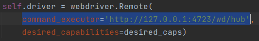

# How to use Appium + WinAppDriver

## Requirements
- [WinAppDriver](https://github.com/microsoft/WinAppDriver/releases) must be installed at "Program Files" or "Program Files (x86)"
  - developer mode must be turned on
- appium version == v1.19.1
  - npm install -g appium@1.19.1
- appium-windows-driver must be installed, but version doesn't matter 
  - npm install appium-windows-driver
- path "wd/hub" must be attached after appium server IP when initializing webdriver
  - e.g. http://127.0.0.1:4723/wd/hub
  - 

## Step
1. Run Appium server
2. Execute your testing script

## Notice
- For this version of appium, capability data type is dict. While in the newer version, it have to use load_capability() to convert to appium's custom data type.