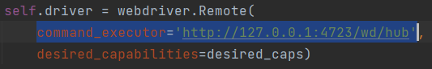

# How to use Appium + WinAppDriver

## Requirements
- [WinAppDriver](https://github.com/microsoft/WinAppDriver/releases) must be installed at "Program Files" or "Program Files (x86)"
  - developer mode must be turned on
- Node.js installed and npm path specified. [link](https://docs.npmjs.com/downloading-and-installing-node-js-and-npm)
- appium version == v1.19.1
  - npm install -g appium@1.19.1
- appium-windows-driver must be installed, but version doesn't matter 
  - npm install appium-windows-driver
- Appium-Python-Client==1.0.2
  - specified in "../requirements.txt"
- path "wd/hub" must be attached after appium server IP when initializing webdriver
  - e.g. http://127.0.0.1:4723/wd/hub
  - 

## Why the older version
- WinAppDriver only support two action type (pen and touch pointer) in the latest Appium version, where mouse type is not supported.
- While the required version of appium and Appium-Python-Client mentioned above does support mouse type action.
- If you just want to do simple action which not including ActionChains class in selenium, you can use the latest version of Appium and Appium-Python-Client. 

## Step
1. Write your testing script
   - You can refer my code "usecase_testing.py" as a sample
2. Run Appium server
3. Execute your testing script

## Notice
- For this version of appium, capability data type is dict. While in the newer version, it have to use load_capability() to convert to appium's custom data type.